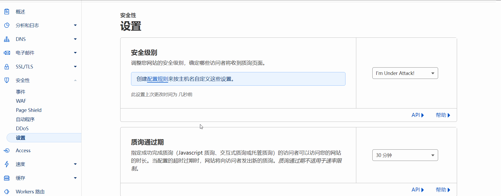

<center>
  
# Cloudflare + Nginx + Docker官方Register 搭建专属加速Docker镜像源

项目描述：只实现Docker镜像源拉取，解决国内镜像源失效问题，并没有实现Docker推送功能。

</center>

# 1. 前提准备（中转机）
- 准备一个域名。
- 一台能访问国际互联网服务器,充当中转站（最好就是流量大的）。
- 注册一个`Cloudflare`，`Docker Hub`账号。
- 在服务器安装`Docker`、`Docker-Compose`。
## 1.1 Cloudflare 配置
- 解析域名（`DNS`）到服务器IP，开启`CDN`加速，会默认开启`HTTPS`协议。
- 安全性->设置->安全级别（本质上为关）
- 规则->页面规则->创建页面规则->URL（填写代理域名/*）->选取设置（禁用安全性）。
  
## 1.2 修改config.yml
  
## 1.3 修改nginx.conf
   
## 1.4 使用到的docker命令
### 启动
```
cd docker-agent && docker-compose up -d
```
### 停止
```
docker-compose down
```
# 2. 客戶端

## 2.1 配置文件 /etc/docker/daemon.json
```bash
sudo nano /etc/docker/daemon.json
```
```
{
  "registry-mirrors": ["https://你的域名"]
}
```
## 2.2 重启docker
```bash
sudo systemctl restart docker
```
## 2.3 访问
```
https://你的域名/v2/_catalog
```
刚启动的时候是空的需要你docker pull 镜像，再访问看到被拉取的内容存在即说明完成。
搭建好的地址镜像源（随时跑路）：https://register.liberx.info
